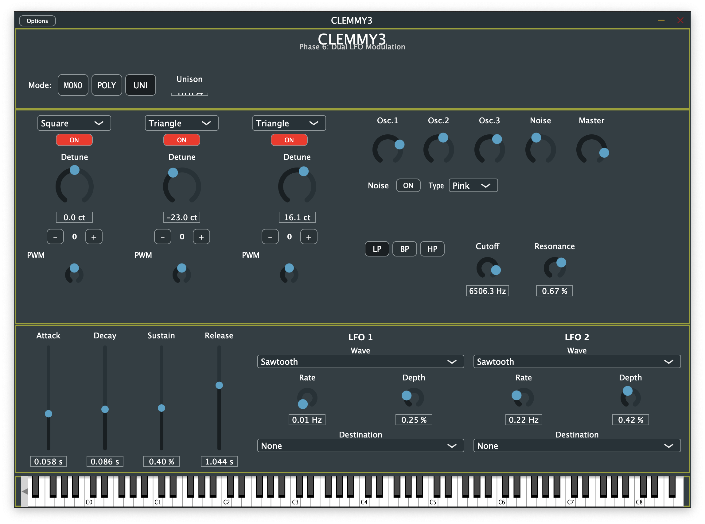

# CLEMMY3

A vibe-coded triple oscillator subtractive synthesizer plug-in, free for everyone to have fun with!



## Description

C++/JUCE port of the [Python Triple Oscillator](https://github.com/clemgoub/TripleOscillator) synthesizer, creating a professional VST3/AU plugin for use in any DAW.

**Status:** ✅ Phase 6 Complete - Dual LFO Modulation System

## Features

### ✅ Implemented

- **🎹 Triple Oscillator Architecture**
  - 3 independent oscillators per voice
  - 5 waveforms per oscillator: Sine, Sawtooth, Square, Triangle, Noise
  - Individual enable/disable, gain, detune (±100 cents), octave shift (-3 to +3)
  - Pulse width modulation (1-99%) for square waves with PolyBLEP anti-aliasing
  - Post-mixer envelope architecture for efficiency

- **🎚️ 8-Voice Polyphony**
  - Three voice modes: Mono (last note priority), Poly (up to 8 voices), Unison (detuned chorus)
  - Adjustable unison detune (5-25 cents) for variable chorus intensity
  - Random phase initialization eliminates phaser artifacts in unison mode
  - LRU (Least Recently Used) voice stealing algorithm
  - Smooth envelope retriggering for glitch-free voice transitions
  - Per-voice independent modulation

- **🔊 Moog Ladder Filter**
  - 4-pole ladder topology with feedback
  - Three modes: Low Pass (24dB/oct), Band Pass (notch-type), High Pass
  - Cutoff: 20Hz - 12kHz with frequency warping compensation
  - Resonance: 0.0 - 1.0 (up to self-oscillation)
  - Tanh saturation for analog warmth and low-end character
  - Frequency-dependent feedback reduction prevents volume drop at high cutoff + resonance
  - True bandpass filter cuts both lows and highs

- **📊 Dual LFO Modulation System**
  - 2 independent LFOs per voice (16 total across 8 voices)
  - 5 waveforms: Sine, Triangle, Square, Sawtooth, Sample & Hold
  - Rate: 0.01 - 20 Hz (logarithmic scaling)
  - Depth: 0.0 - 1.0
  - 6 modulation destinations:
    * Filter Cutoff (±2 octaves)
    * Filter Resonance (±0.5 range)
    * Pitch - Vibrato effect (±1 semitone, all oscillators)
    * PWM - Pulse width modulation (25-75% range)
    * Volume - Tremolo effect (50-100%, never silent)
    * None (bypass)

- **🎵 ADSR Envelope Generator**
  - Attack: 0.001 - 2.0s (skewed range, 10ms minimum for click prevention)
  - Decay: 0.001 - 2.0s (skewed range)
  - Sustain: 0.0 - 1.0 (linear)
  - Release: 0.001 - 5.0s (skewed range)
  - Velocity-sensitive dynamics
  - Full ADSR state machine with smooth transitions

- **🎲 Noise Generator**
  - Three noise types: White, Pink, Brown
  - Per-voice noise with envelope control
  - Independent gain control
  - Mixed like a 4th oscillator

- **🖥️ Clean Minimal GUI**
  - 1100×750px window optimized for workflow
  - Triple oscillator controls (waveform, detune, octave, PWM)
  - Mixer section (3 oscillators + noise + master volume)
  - Filter section (mode buttons, cutoff, resonance)
  - ADSR envelope sliders
  - Dual LFO controls (waveform, rate, depth, destination)
  - Virtual MIDI keyboard with computer keyboard support
  - All parameters automatable in DAW

### 🚧 Planned for Future Phases

- 💾 Preset system with save/load functionality
- 🎨 Enhanced GUI with custom graphics and visualizations
- 🔧 Additional modulation routing options
- 📈 Oscilloscope/spectrum analyzer
- ⚡ Performance optimizations

## Current Phase: Phase 6 ✅

**Phase 6: Dual LFO Modulation System**
- ✅ LFO engine with 5 waveforms
- ✅ 2 LFOs per voice (16 total)
- ✅ 6 modulation destinations (Filter Cutoff/Res, Pitch, PWM, Volume)
- ✅ Per-sample modulation with phase reset on note-on
- ✅ Complete UI with dual LFO sections
- ✅ All modulation destinations tested and verified

## Technical Highlights

- **Audio Quality:**
  - Professional-grade DSP with PolyBLEP anti-aliasing
  - No clicks, pops, or digital artifacts
  - Sample-accurate modulation and envelope processing
  - Proper frequency calculation across full MIDI range
  - NaN/infinity protection with automatic reset

- **Architecture:**
  - Per-voice signal chain: LFOs → Modulation → 3 Oscillators → Mix → Filter → Envelope → Volume Mod → Output
  - Post-mixer envelope (single ADSR for all oscillators per voice)
  - Fixed gain compensation (no dynamic normalization to prevent clicks)
  - Thread-safe parameter updates via AudioProcessorValueTreeState

- **Parameters:**
  - 45 total parameters (fully automatable in DAW)
  - 2 voice mode (mode + unison detune), 18 oscillator params, 4 ADSR, 3 noise, 1 master volume, 3 filter, 8 LFO1, 8 LFO2

## Building

### Prerequisites

- CMake 3.15+
- C++17 compiler (Xcode 12+, Visual Studio 2019+, or GCC 9+)
- JUCE Framework 8.0+ installed at `~/JUCE`

### Build Instructions

```bash
# Configure
mkdir build
cd build
cmake ..

# Build
cmake --build . --config Release

# The plugins will be automatically installed to:
# macOS: ~/Library/Audio/Plug-Ins/VST3/ and ~/Library/Audio/Plug-Ins/Components/
# Windows: C:\Program Files\Common Files\VST3\
# Linux: ~/.vst3/
```

For detailed build instructions, see [BUILD_GUIDE.md](Docs/BUILD_GUIDE.md)

### Supported Formats

- **VST3** (Windows, macOS, Linux)
- **AU** (macOS only)
- **Standalone** application

## Testing

### Quick Test

1. **Standalone App:**
   ```bash
   open build/CLEMMY3_artefacts/Release/Standalone/CLEMMY3.app
   ```

2. **In DAW:**
   - Load VST3 or AU in your DAW
   - Play MIDI notes with your keyboard or draw MIDI in the piano roll
   - Experiment with oscillators, filter, envelope, and LFO modulation!

### Testing Tips

- **Vibrato**: Set LFO1 to Pitch destination, depth ~50%, rate ~5Hz
- **Tremolo**: Set LFO1 to Volume destination, depth ~100%, rate ~4Hz
- **PWM Sweep**: Enable square wave, set LFO to PWM destination, depth ~100%
- **Filter Sweep**: Set LFO to Filter Cutoff, adjust resonance for character
- **Unison Mode**: Switch to UNI mode and adjust detune (5-25 cents) for thick, chorused sound without phaser artifacts

## Development

- **Development Plan**: [DEVELOPMENT_PLAN.md](DEVELOPMENT_PLAN.md)
- **Architecture**: [Docs/ARCHITECTURE.md](Docs/ARCHITECTURE.md)
- **Python Reference**: [Docs/PYTHON_REFERENCE.md](Docs/PYTHON_REFERENCE.md)
- **UI Customization**: [Docs/UI_CUSTOMIZATION_GUIDE.md](Docs/UI_CUSTOMIZATION_GUIDE.md)

## Project Structure

```
CLEMMY3/
├── Source/              # C++ source code
│   ├── PluginProcessor.cpp/h    # Main audio engine & parameters
│   ├── PluginEditor.cpp/h       # GUI implementation
│   └── DSP/                     # DSP components
│       ├── Oscillator.cpp/h     # PolyBLEP oscillator (5 waveforms)
│       ├── Envelope.cpp/h       # ADSR envelope generator
│       ├── Voice.cpp/h          # Single voice (3 oscillators + envelope + filter + 2 LFOs)
│       ├── VoiceManager.cpp/h   # 8-voice polyphony & voice stealing
│       ├── MoogFilter.cpp/h     # 4-pole Moog ladder filter
│       ├── LFO.cpp/h            # Low-frequency oscillator
│       ├── NoiseGenerator.cpp/h # White/Pink/Brown noise
│       └── AudioUtils.h         # Utility functions (PolyBLEP, clamp, etc.)
├── Assets/              # Plugin assets
│   └── Icons/           # App icons
├── Docs/                # Documentation
├── build/               # Build output
└── reference-python/    # Original Python implementation
```

## Phase Progress

**Completed Phases:** 6/9 (67% Complete)

- ✅ Phase 0: Foundation & Project Setup
- ✅ Phase 1: Single Oscillator Engine with PolyBLEP
- ✅ Phase 2: ADSR Envelope Generator
- ✅ Phase 3: Voice Polyphony & Management
- ✅ Phase 4: Triple Oscillator Architecture
- ✅ Phase 5: Moog Ladder Filter
- ✅ Phase 6: Dual LFO Modulation System
- 🚧 Phase 7: Preset Management System (Next)
- 🚧 Phase 8: Enhanced GUI & Visualizations
- 🚧 Phase 9: Final Polish & Optimization

## License

See [LICENSE](LICENSE)

## Credits

- Original Python implementation: [clemgoub/TripleOscillator](https://github.com/clemgoub/TripleOscillator)
- Built with [JUCE Framework](https://juce.com)
- Developed with assistance from Claude (Anthropic)

---

**🎵 Enjoy making music with CLEMMY3! 🎵**
